# Manual Técnico
Esta aplicacion fue elaborada por dos lenguajes, el primer lenguaje utilizado fue golang con el cual se construyo la parte de front-end, es decir la parte que vera el usuario.
El segundo lenguaje utilizado fue javascript junto con typescript, estos dos lenguajes se utlizaron para la parte del back-end, es decir toda la parte logica y de analisis de toda la aplicacion.
Todo esto fue encapsulado en contenedores utilizando la herramienta dockerhub.

### Cliente
Para la parte del cliente se utilizo el lenguaje golang para poder crear el servidor y que el usuario vea la interfaz grafica, siendo servido en el puerto :8080

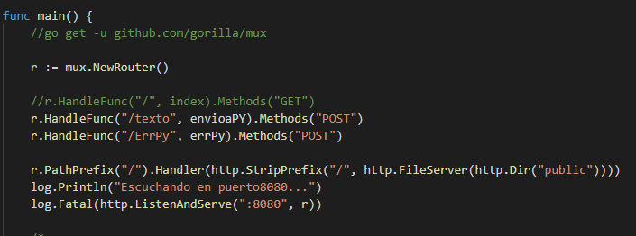

### Analisis
Para el analisis de esta aplicacion se utilizo un analizador lexico y un analizador sintactico, luego de esto se procede a traducir si no se encuentran errores en el analisis sintactico

#### Analisis Léxico
Se utilizó el siguiente AFD para conseguir el analisis léxico exitoso utilizando metodos y una lista para los tokens que se reconocieron correctamente.

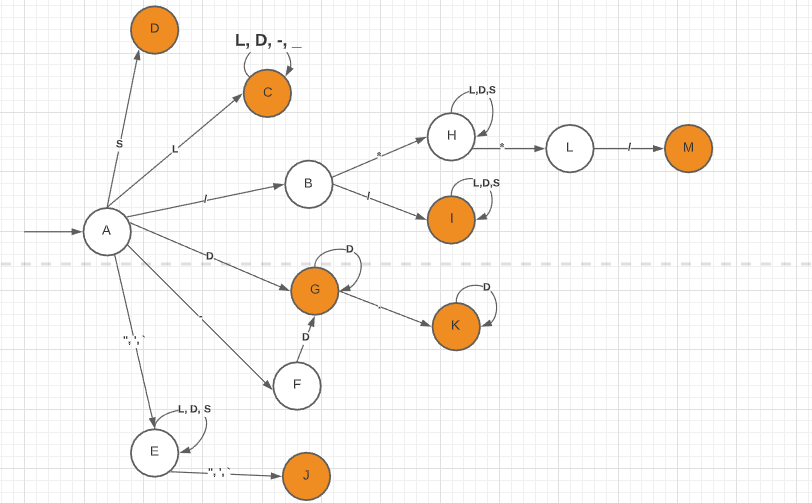
Se utilizo la siguiente estructura de clases para poder guardar correctamente los tokens reconocidos y los posibles errores que se fueran encontrando.

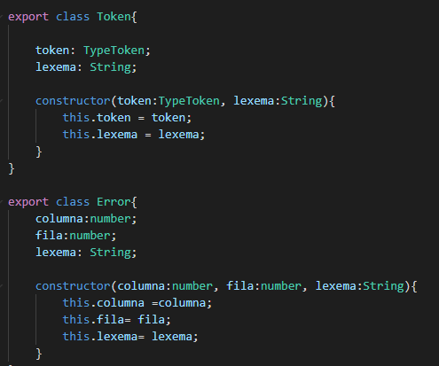

También se hizo uso de una libreria Enum para enumerar cada uno de los lexemas validos en nuestro lenguaje a Analizar, osea java.

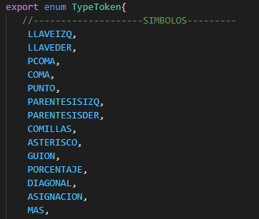
Para la elaboracion del analizador lexico se utilizaron metodos los cuales llevaron un orden segun nuestro AFD para poder analizar de manera correcta el lenguaje.

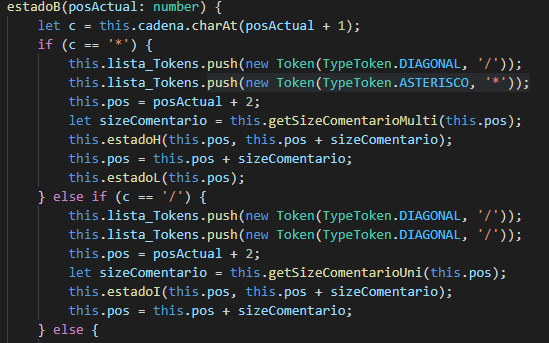
Los tokens reconocidos correctamente se fueron almacenando en una lista, una lista de tokens la cual se mandaba como parametro al analizador sintactico.

#### Analisis Sintactico
Para el analisis sintactico se utilizo una gramatica, en su mayoria recursiva por la derecha, esto para evitar la ambiguedad y la recursividad por la izquierda la cual no es recomendable para estos proyectos. 
La gramatica utilizada fue la siguiente:

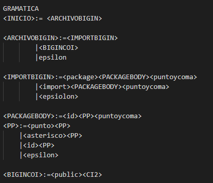
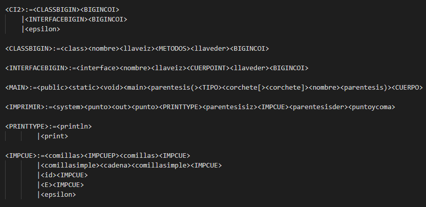
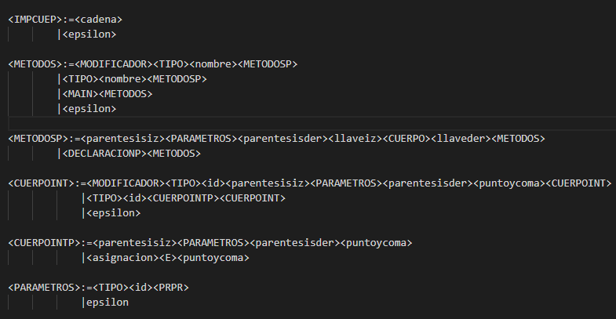
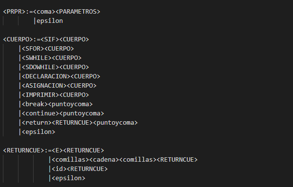
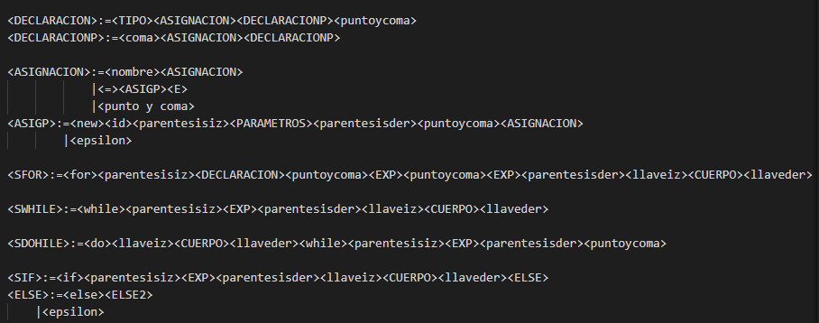
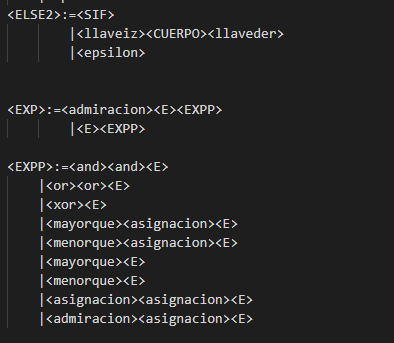
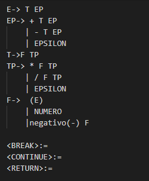
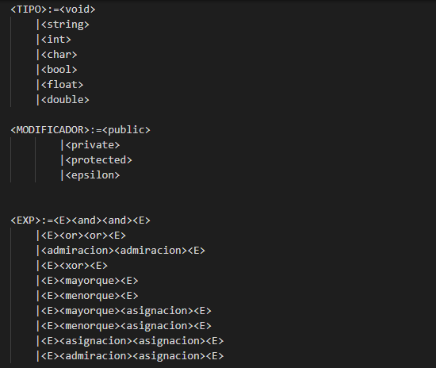