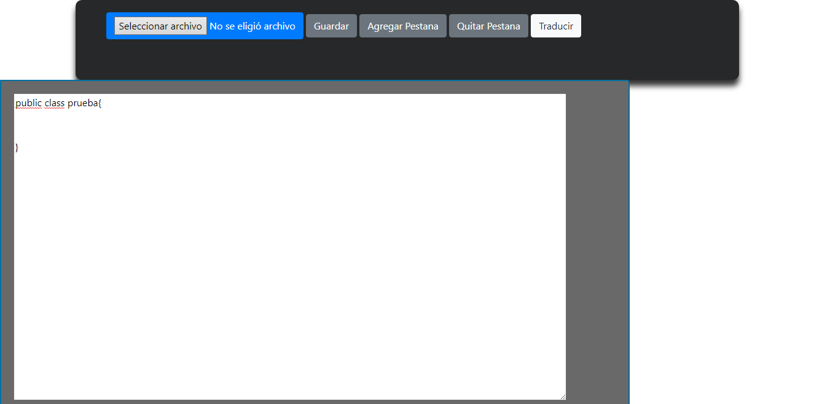
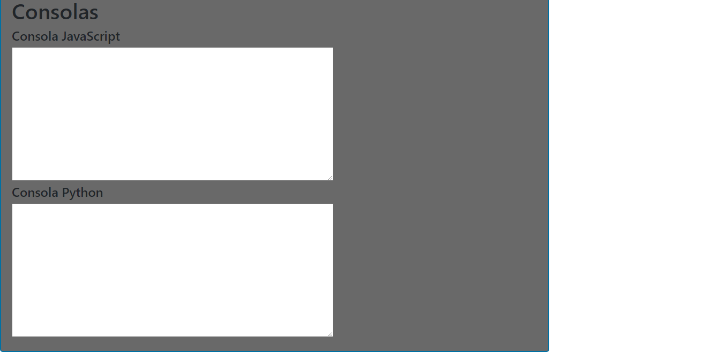

# Manual Usuario

Esta aplicacion fue elaborada por dos lenguajes, el primer lenguaje utilizado fue golang con el cual se construyo la parte de front-end, es decir la parte que vera el usuario.
El segundo lenguaje utilizado fue javascript junto con typescript, estos dos lenguajes se utlizaron para la parte del back-end, es decir toda la parte logica y de analisis de toda la aplicacion.
Todo esto fue encapsulado en contenedores utilizando la herramienta dockerhub

  - Dockerhub
   

  - Golang
   

  - Javascript
  

# Front-End

Para el front-end tenemos las siguientes funcionalidades :
  - Boton seleccionar archivo
  - Boton guardar archivo
  - Boton Traducir
  - Boton agregar pestaña
  - Boton quitar pestaña
  - Area de texto
  - Consolas de salida

### Botón seleccionar
Con el boton seleccionar archivo podremos buscar un archivo en nuestro computador, y la interfaz lo abrira y mostrara en el area de texto para modificar o traducir seguin sea el caso.

### Botón guardar archivo
Con este boton podremos guardar nuestro progreso escrito en el area de texto, nos genera un archivo con la extensión deseada.

### Botón traducir
Con este boton podremos enviar nuestro codigo que se encuentra en el area de texto, para ser traducido, este boton envia el codigo a la parte del back-end y esta parte ya se encarga de analizar todo el codigo y encontrar errores lexicos o sintacticos en su defecto, si encuentra algun error lexico, el analizador lo corrige y sigue con el analisis, y si encuentra algun error de tipo sintactico el analizador lo reporta y sigue con el analisis pero no se genera la traduccion del archivo.

### Botón agregar pestaña
Este boton nos agrega una pestaña en la cual podremos ingresar codigo para ser traducido.
### Botón quitar pestaña
Este boton nos cerrara una de las pestañas que tengamos abiertas.
### Área de texto
Tendremos un área especifica en la cual se mostrara el codigo que hayamos ingresado o escrito en su defecto, para ser analisado posteriormente.

### Consolas de salida
En estas consolas se visualizaran todos los errores que el codigo tenga, en estas consolas podremos visualizar todo el proceso por el cual paso el codigo ingresado.

### Reporte de errores
Para los reportes de errores se generaran unas tablas en las cuales se visualizaran los errores lexicos que el condigo mandado a nalizar tenga. 
Luego podremos visualizar los errores sintacticos en caso hubiera y por ultimo podremos visualizar el arbol de analisis sintactico en forma de imagen.